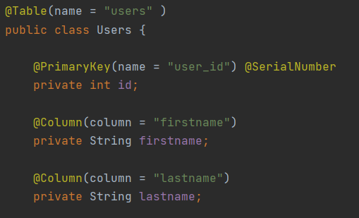
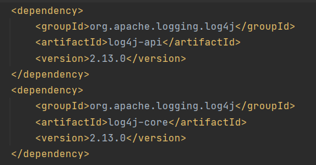
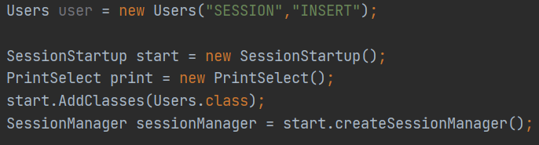
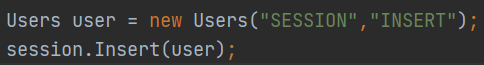

# SupremeSQL_p1
SupremeSQL is a very basic custom ORM Framework for easy interaction with the Database. This ORM currently only works with Postgres. 

# Setting Up the ORM 
### Annotation
Annotating the Class and its Fields

Also, generate toString , equals, and hashcode methods for each classes

### Connection
To connect to the Datebase, you need to create application.properties file in your src/main/resource folder 

Within the application.properties file, you need to add the following:

postgres.driver= org.postgresql.Driver

postgres.url= the url of the database

postgres.username= your username

postgres.password= your password

### Logger 
To setup the Loggers, you need to add log4j2 dependencies

### Session
To setup a Session and use the SQL methods, you need to do the following:

1) Create a SessionManager Object
2) Add Classes to SessionManager
3) Create a Session Object and set it equals to the SessionManger object and use its getSession method

It should look similar to the image below 

### SQL Methods
Using the Session object, you could use the CRUD methods

The CRUD methods are:
1) SelectAll
2) SelectFrom
3) Insert
4) Delete
5) Update

Example:

### Printing Select 
This ORM provides a special print method for the Select methods.
You have to create a PrintSelect object and use its printRow method

To further customize the output, you could play around with the toString method in each model classes

# Demo
Below is a Github link to a Demo for the ORM

[Demo for ORM](https://github.com/ZGCalvin/SupremeSQLUsage)