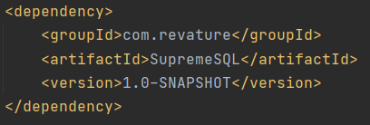

# Project 1 - Custom Object Relational Mapping Framework
### SupremeSQL_p1
SupremeSQL is a basic custom ORM Framework for easy interaction with the Database. This ORM connects to the Postgres database with HikariCP as my connection pooling framework. Loggers could be setup to provide informational log messages. SupremeSQL offers a Session-based caching to minimize calls to the database. The SQL methods that Session is able to call are select all, select from specified columns, insert into, update , and delete. 

# Technologies Used
* Java - version 8.0
* Apache Maven - version 3.6.3
* PostGreSQL - version 12.4
* Git SCM (on GitHub) - version 2.30.1
* Junit - version 4.13
* Mockito - version 1.10.19
* Log4j2 - version 2.13.0

# Features 
List of features ready and TODOs for future development

* A public API that can be added as a dependency in other projects
* Programmatic persistence of entities (basic CRUD support)
* Connection Pooling
* Lightweight session creation
* Session-based caching to minimize calls to the database
* Log4j2 to output log statements to a log file
* JUnit and Mockito to unit test methods

To-do list:

* Add transactions to the ORM. Would like to give the user the chance to not immediately update the database records and wait until they commit the records
* Add create table functionality to the ORM. The user would be able to create a table in the database. 
* Add join table method. The user is able to connect two or more tables together.

# Getting Started
## Install ORM
1. Clone Github Repository in your terminal using git clone https://github.com/210119-java-enterprise/SupremeSQL_p1.git
3. Use SupremeSQL-1.0-SNAPSHOT.jar within the target file as a dependency within your Maven project

## Setting Up the ORM 
### Annotation
Annotating the Class and its Fields

1. @Table to mark the class as an Entity
2. @PrimaryKey to represent the Primary Key within the database
3. @Serial to represent a serial value within the database
4. @Column to mark the field as a column within the database

Also, generate toString , equals, and hashcode methods for each classes

### Connection
To connect to the Datebase, you need to create application.properties file in your src/main/resource folder 

Within the application.properties file, you need to add the following:

postgres.driver= org.postgresql.Driver

postgres.url= the url of the database

postgres.username= your username

postgres.password= your password

### Logger 
To setup the Loggers, you need to add log4j2 dependencies

### Session
To setup a Session and use the SQL methods, you need to do the following:

1) Create a SessionManager Object
2) Add Classes to SessionManager
3) Create a Session Object and set it equals to the SessionManger object and use its getSession method

It should look similar to the image below 

### SQL Methods
Using the Session object, you could use the CRUD methods

The CRUD methods are:
1) SelectAll
2) SelectFrom
3) Insert
4) Delete
5) Update

Example:

### Printing Select 
This ORM provides a special print method for the Select methods.
You have to create a PrintSelect object and use its printRow method

To further customize the output, you could play around with the toString method in each model classes

# Demo
Below is a Github link to a Demo for the ORM

[Demo for ORM](https://github.com/ZGCalvin/SupremeSQLUsage)
