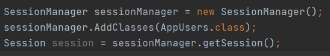

# SupremeSQL_p1
SupremeSQL is a very basic custom ORM Framework for easy interaction with the Database. 

# Setting Up the ORM 
### Annotation
Annotating the Classes the Fields

### Connection
To connect to the Datebase, you need to create Application.properties file in your src/main/resource folder 

Within the Application.properties file, you need the add the following:
postgres.url= the url of the database
postgres.username= your username
postgres.password= your password

### Session
To setup the Session and use SQL statements, you need to do the following:

1) Create a SessionStartup Object
2) Add classes to SessionStartup Object by using AddClasses method
3) Create a SessionManager Object and set it equals to SessionStartup object and used the createSessionManager object
4)  Create a Session Object and set it equals to the SessionManger object and use its getSession method

It should look similar to the image below 

### SQL Statements 
Using the Session object, you could use the CRUD methods
The CRUD methods are:
1) SelectAll
2) SelectFrom
3) Insert
4) Delete
5) Update

Example:

